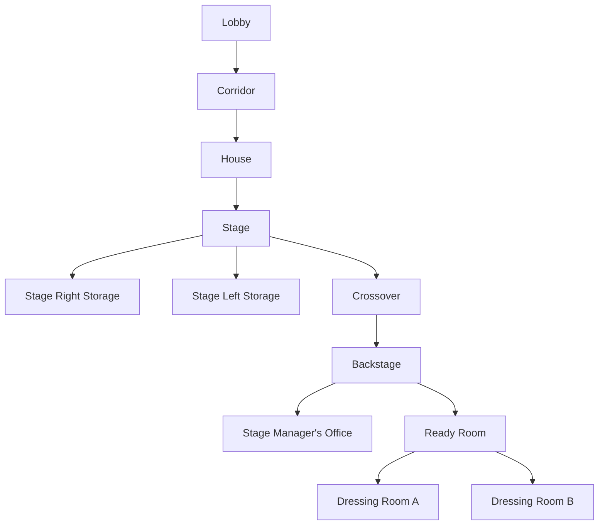

```mermaid
graph TD
  A1[Lobby] --> A2[Corridor]
  A2 --> A3[House]
  A3 --> A4[Stage]
  A4 --> A5[Stage Right Storage]
  A4 --> A6[Stage Left Storage]
  A4 --> A7[Crossover]
  A7 --> A8[Backstage]
  A8 --> A9[Stage Manager's Office]
  A8 --> A10[Ready Room]
  A10 --> A11[Dressing Room A]
  A10 --> A12[Dressing Room B]
```